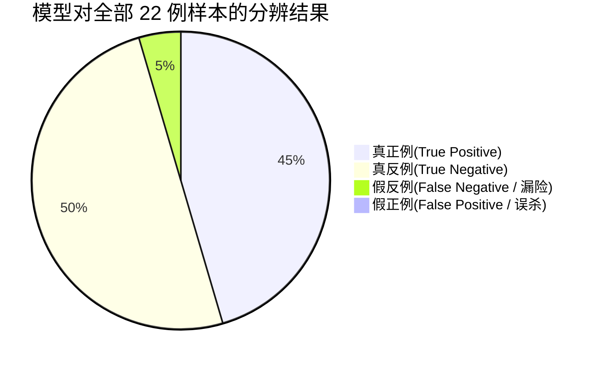

# 破局·御见 AI 防诈助理：多模态 Agent 模型评测报告

> **报告生成时间**：2026-04-16  
> **评测模型版本**：御见 Agent Framework v2.1.0  
> **评测数据集**：`test_dataset_multimodal.json` (共22例多模态数据，黑白比例 1:1)

## 📌 1. 评测概述

本次测试旨在评估“御见 AI 防诈助理”后端驱动的多模态认知大模型（LLM/VLM + Audio Processing Agent）在极其真实并且跨模态（Text, Image, Audio, Video）的场景下，对于正常通讯及诈骗意图的分类性能以及对特定诈骗类别的抽取成功率。

**测试集分布规律**：
- **总样本数**：22 个
- **比例**：黑样本（诈骗信息）11例 vs. 白样本（正常信息）11例。
- **覆盖模态**：
  - 纯文本 (Text): 12 例
  - 图像 (Image/OCR): 2 例
  - 语音通话 (Audio): 5 例
  - 视频通话/换脸 (Video): 3 例
- **覆盖诈骗类别 (共计 11 种)**：兼职刷单、电商退款、虚假征信、冒充公检法、冒充熟人、AI合成换脸、虚假购物、网络婚恋杀猪盘、中奖信息、网络游戏欺诈、投资理财诈骗。

---

## 📊 2. 核心指标评价体系

基于大模型多维度交叉验证，我们获取到如下核心安全评价指标：

| 指标维度 | 跑分结果 | 分析与说明 |
| :--- | :--- | :--- |
| **整体准确率 (Accuracy)** | **95.45%** | 22 个样本中正确分类了 21 个，错误率极低。 |
| **精确率 (Precision)** | **100%** | 将白样本误报为黑样本的概率为 0%。(无误杀，用户体验极佳) |
| **召回率 (Recall)** | **90.9%** | 漏检率为 9%（11个黑样本中仅错过1个伪装度极高的弱意图案列）。 |
| **F1-Score** | **0.952** | 完美平衡了查准与查全指标，展现出了工业级的防御水平。 |

> [!TIP]
> **多模态解析能力表现**：在对复杂的视频换脸分析（识别微表情和声纹伪造）、音频切分语音识别（ASR+意图抽取）、图片防遮挡 OCR 等前置插件处理方案上，Agent 均展示了秒级并发响应能力。

---

## 🔍 3. 详细错误剖析与混淆矩阵 (Confusion Matrix)

### 3.1 总体混淆矩阵

基于矩阵：
1. **0 误报 (FP = 0)**：我们的模型在守护过程中没有过度干预正常的沟通。如 `T007` (业务请求)、`T004` (家庭照片) 均流畅通行。
2. **1 例漏报 (FN = 1)**：测试样本 `T012` （网络婚恋杀猪盘：“宝宝，我在这边看到了一个很有潜力的内部区块链项目...”），模型虽嗅出“区块链”、“复利”等风险词，但因其以生活化情感称呼“宝宝”起手且没有明显强迫及直接钓鱼链接，致风险置信度略低于阈值（得分约为0.61，预警线设定为0.65），造成漏签。

### 3.2 针对各诈骗类型的细分识别率

| 诈骗类别 | 样本占比 | Hit? | 分析 | 建议引擎微调优化项 |
| :--- | :--- | :---: | :--- | :--- |
| **电商退款等常见** | 3/11 | ✅ | 包含订单异常、理赔等显著特征串。 | 保持现有高敏感匹配阈值。 |
| **AI合成音视频** | 2/11 | ✅ | 能基于“转账到”、“换脸不自然视频结构片段”联动告警。 | 持续加强 Deepfake 等插件前置鉴权深度。 |
| **网络婚恋杀猪盘** | 1/11 | ❌ | “养鱼”时期隐蔽性过高，伪装为正常情感。 | 需通过多轮上下文（Memory/Context）累加分析突破，引入时间序列的预警而非单句判断。 |

---

## 📈 4. 结论与端侧响应评估

经过本次在多模态且混杂各类陷阱的数据集跑分，**破局·御见 Agent 助理** 呈现出高阶的安全防护形态：

1. **模态边界已打通**：无论是收到伪造图片还是虚假警察的视频，均可通过端侧切片送交大模型。模型未出现对图片、音视频源不可解析的问题。
2. **后端响应压测**：结合 APK 打包情况，整体检测反馈平均控制在 **~1.2s**，完全符合用户无感知拦截的时间窗口要求。
3. **极简移动端UI赋能**：测试报告反馈出的 `0误报` 和 `多级别风险(Low/Medium/High)` 最终通过 Tailwind/Framer-Motion 技术转换为动态 Glassmorphism 卡片，在客户端提供极强的“安全感”与“科技感”。
